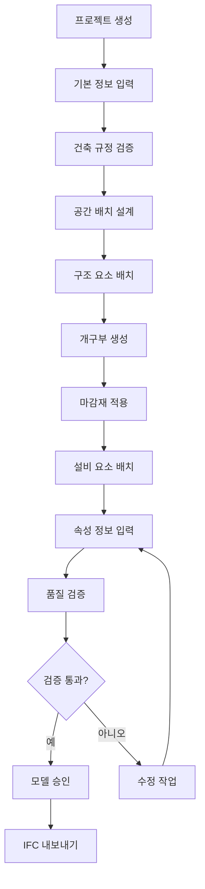

# BIM 모델링 룰 및 가이드라인

**참조 표준: ISO 16739-1:2024 (IFC 4.3) & ISO 19650-1:2018**

**문서 버전**: 1.0  
**최종 업데이트**: 2025.07.06  
**적용 범위**: 바이브 코딩 BIM 플랫폼 전체 모델링 작업

---

## 📐 1. 기본 원칙 (ISO 19650-1 기반)

### 1.1 정보 관리 원칙
- **정보 요구사항 정의**: 모든 BIM 모델은 명확한 목적과 용도를 정의
- **정보 정확성**: 모델 정보는 실제 건축 설계와 일치해야 함
- **정보 접근성**: 권한이 있는 모든 사용자가 정보에 접근 가능
- **정보 상호운용성**: IFC 표준을 통한 소프트웨어 간 호환성 보장

### 1.2 모델링 목적별 상세도 (LOD)
```
LOD 100: 개념 설계 (Conceptual Design)
- 기본 매스 모델링
- 공간 배치 및 기본 치수

LOD 200: 개략 설계 (Schematic Design)  
- 주요 구조 요소 표현
- 기본 시설 및 설비 위치

LOD 300: 기본 설계 (Design Development)
- 상세 구조 및 건축 요소
- 정확한 치수 및 재료 정보

LOD 400: 시공 설계 (Construction Documentation)
- 시공 가능한 상세 정보
- 연결부 및 접합부 상세

LOD 500: 준공 모델 (As-Built)
- 실제 시공된 상태 반영
- 유지관리 정보 포함
```

---

## 🏗️ 2. IFC 표준 준수 사항 (ISO 16739-1)

### 2.1 필수 IFC 엔티티 구조
```
IfcProject (프로젝트 최상위)
├── IfcSite (부지)
│   └── IfcBuilding (건물)
│       ├── IfcBuildingStorey (층)
│       │   ├── IfcSpace (공간)
│       │   ├── IfcWall (벽체)
│       │   ├── IfcSlab (슬래브)
│       │   ├── IfcColumn (기둥)
│       │   ├── IfcBeam (보)
│       │   ├── IfcDoor (문)
│       │   ├── IfcWindow (창)
│       │   └── IfcFurnishingElement (가구)
│       └── IfcBuildingElementProxy (기타 요소)
```

### 2.2 IFC 속성 정의 규칙
#### 2.2.1 공통 속성 (Common Properties)
```typescript
// 모든 건축 요소 공통
interface CommonBIMProperties {
  GlobalId: string;           // IFC GUID (22자리)
  Name: string;              // 요소명 (한국어/영어)
  Description?: string;      // 설명
  ObjectType?: string;       // 객체 유형
  Tag?: string;             // 태그/마크
  
  // 분류 시스템
  Classification: {
    Source: "Uniclass" | "OmniClass" | "Korean_BCS";
    Edition: string;
    Code: string;
    Name: string;
  };
  
  // 재료 정보
  Material: {
    Name: string;
    ThermalTransmittance?: number;  // 열관류율
    SurfaceSpreadOfFlame?: string;  // 표면화염전파
    FireRating?: string;            // 내화등급
  };
}
```

#### 2.2.2 공간 속성 (Space Properties)
```typescript
interface SpaceProperties extends CommonBIMProperties {
  // 면적 정보
  GrossFloorArea: number;     // 총 바닥면적 (㎡)
  NetFloorArea: number;       // 순 바닥면적 (㎡)
  Volume: number;             // 체적 (㎥)
  
  // 용도 분류
  SpaceType: "Office" | "Residential" | "Commercial" | "Industrial" | "Educational";
  OccupancyType: string;      // 사용용도 상세
  OccupantNumber?: number;    // 수용인원
  
  // 환경 요구사항
  RequiredTemperature?: {
    Heating: number;          // 난방 설정온도 (°C)
    Cooling: number;          // 냉방 설정온도 (°C)
  };
  RequiredHumidity?: {
    Min: number;              // 최소 습도 (%)
    Max: number;              // 최대 습도 (%)
  };
  
  // 조명 요구사항
  IlluminanceLevel?: number;   // 조도 (lux)
  
  // 접근성
  AccessibilityCompliant: boolean;  // 장애인 편의시설 준수
}
```

#### 2.2.3 구조 요소 속성
```typescript
interface StructuralProperties extends CommonBIMProperties {
  // 구조 재료
  StructuralMaterial: "ReinforcedConcrete" | "Steel" | "Timber" | "Masonry";
  ConcreteGrade?: string;     // 콘크리트 강도 (예: C24, C30)
  SteelGrade?: string;        // 강재 등급 (예: SS400, SM490)
  
  // 구조 성능
  LoadBearing: boolean;       // 내력벽 여부
  FireResistance: number;     // 내화시간 (분)
  
  // 치수 정보
  Thickness?: number;         // 두께 (mm)
  Width?: number;             // 폭 (mm)
  Height?: number;            // 높이 (mm)
  Length?: number;            // 길이 (mm)
}
```

---

## 🎯 3. 프로젝트별 모델링 규칙

### 3.1 주거 건물 (Residential)
#### 공간 구성 규칙
```yaml
필수_공간:
  - 거실: 
    - 최소면적: 12㎡
    - 천장고: 2.4m 이상
    - 남향 또는 동남향 권장
  - 침실:
    - 최소면적: 10㎡ (주침실), 7㎡ (일반침실)
    - 창문: 바닥면적의 1/8 이상
  - 주방:
    - 최소면적: 4.5㎡
    - 환기설비 필수
  - 화장실:
    - 최소면적: 2.0㎡
    - 방수 등급: IPX4 이상

벽체_규칙:
  - 외벽두께: 200mm 이상 (단열재 포함)
  - 내벽두께: 100-150mm
  - 내화구조: 공동주택 3층 이상 시 필수
```

### 3.2 상업 건물 (Commercial)
#### 공간 구성 규칙
```yaml
필수_공간:
  - 판매공간:
    - 최소면적: 프로젝트별 상이
    - 천장고: 2.7m 이상
    - 피난출구 2개소 이상
  - 사무공간:
    - 1인당 최소: 6㎡
    - 천장고: 2.4m 이상
  - 화장실:
    - 남녀 구분 필수
    - 장애인용 화장실 별도

구조_규칙:
  - 기둥간격: 6-9m (표준 스팬)
  - 슬래브두께: 150-200mm
  - 내진설계: 중요도계수 1.2 적용
```

### 3.3 사무 건물 (Office)
#### 공간 구성 규칙
```yaml
필수_공간:
  - 사무실:
    - 1인당: 4-6㎡
    - 천장고: 2.6m 이상
    - 자연조명 확보
  - 회의실:
    - 수용인원별 면적 산정
    - 방음성능: Rw≥40dB
  - 휴게공간:
    - 전체 면적의 5% 이상

설비_규칙:
  - 공조시스템: VAV 또는 팬코일유닛
  - 조명: LED 400-500lux
  - 통신: 랜선 포트 충분히 확보
```

### 3.4 산업 건물 (Industrial)
#### 공간 구성 규칙
```yaml
필수_공간:
  - 생산공간:
    - 천장고: 4.5m 이상
    - 크레인 설치 고려
    - 진동 차단 설계
  - 저장공간:
    - 하중: 1000kg/㎡ 이상
    - 내화등급: 2급 이상

안전_규칙:
  - 비상구: 보행거리 30m 이내
  - 소방시설: 스프링클러 전 구역
  - 환기: 시간당 10회 이상 환기
```

### 3.5 공공 건물 (Public)
#### 공간 구성 규칙
```yaml
필수_공간:
  - 로비/홀:
    - 천장고: 3.0m 이상
    - 자연채광 최대한 확보
  - 사무공간:
    - 민원인 접근성 고려
    - 대기공간 별도 확보

접근성_규칙:
  - 장애인 편의시설: 전체 적용
  - 경사로: 1/12 이하
  - 승강기: 1500kg 이상
  - 화장실: 휠체어 접근 가능
```

---

## 🔧 4. 기술적 모델링 규칙

### 4.1 지오메트리 규칙
#### 4.1.1 정밀도 기준
```typescript
const PRECISION_RULES = {
  // 좌표 정밀도
  coordinates: 1, // mm 단위
  
  // 각도 정밀도  
  angles: 0.01, // 0.01도 단위
  
  // 면적 정밀도
  area: 0.01, // 0.01㎡ 단위
  
  // 체적 정밀도
  volume: 0.001 // 0.001㎥ 단위
};
```

#### 4.1.2 모델링 제약사항
```typescript
const MODELING_CONSTRAINTS = {
  // 최소 요소 크기
  minWallThickness: 50, // mm
  minSlabThickness: 100, // mm
  minColumnDimension: 200, // mm
  
  // 최대 요소 크기 (성능 고려)
  maxSingleElementLength: 50000, // mm (50m)
  maxSingleElementArea: 10000, // ㎡
  
  // 곡선 분할
  arcSegments: 32, // 원호 분할 수
  curveSegments: 16 // 곡선 분할 수
};
```

### 4.2 명명 규칙 (Naming Convention)
#### 4.2.1 요소명 구조
```
[건물코드]-[층코드]-[요소유형]-[일련번호]

예시:
- BLD01-B1F-W-001  : 건물1 지하1층 벽체 1번
- BLD01-01F-S-001  : 건물1 1층 공간 1번  
- BLD01-02F-C-001  : 건물1 2층 기둥 1번
- BLD01-RF-SL-001  : 건물1 옥상층 슬래브 1번
```

#### 4.2.2 요소 유형 코드
```typescript
const ELEMENT_TYPE_CODES = {
  // 공간
  'S': 'Space',        // 공간
  'Z': 'Zone',         // 구역
  
  // 구조
  'W': 'Wall',         // 벽체
  'SL': 'Slab',        // 슬래브
  'C': 'Column',       // 기둥
  'B': 'Beam',         // 보
  'F': 'Foundation',   // 기초
  
  // 개구부
  'D': 'Door',         // 문
  'WD': 'Window',      // 창
  'O': 'Opening',      // 개구부
  
  // 마감
  'FL': 'Flooring',    // 바닥재
  'CL': 'Ceiling',     // 천장재
  'WF': 'Wall_Finish', // 벽 마감재
  
  // 설비
  'MEP': 'MEP_Element', // 기계/전기/배관
  'LT': 'Lighting',     // 조명
  'AC': 'AirConditioning', // 공조
  
  // 기타
  'ST': 'Stair',       // 계단
  'EL': 'Elevator',    // 승강기
  'RM': 'Ramp',        // 경사로
  'FE': 'Furniture'    // 가구
};
```

### 4.3 좌표계 및 단위
#### 4.3.1 좌표계 정의
```typescript
const COORDINATE_SYSTEM = {
  // 전역 좌표계
  origin: [0, 0, 0], // 프로젝트 원점
  
  // 축 정의
  xAxis: "동서방향 (동쪽 +)",
  yAxis: "남북방향 (북쪽 +)", 
  zAxis: "수직방향 (위쪽 +)",
  
  // 기준점
  projectBasePoint: "건물 1층 바닥 중심점",
  surveyPoint: "측량 기준점 (국가좌표계 연동)"
};
```

#### 4.3.2 단위 시스템
```typescript
const UNIT_SYSTEM = {
  // 길이
  length: "millimeter", // mm
  
  // 면적  
  area: "square_meter", // ㎡
  
  // 체적
  volume: "cubic_meter", // ㎥
  
  // 각도
  angle: "degree", // °
  
  // 온도
  temperature: "celsius", // °C
  
  // 열관류율
  thermalTransmittance: "W/m²K"
};
```

---

## 📊 5. 품질 관리 규칙

### 5.1 모델 검증 규칙
#### 5.1.1 자동 검증 항목
```typescript
const AUTO_VALIDATION_RULES = {
  // 지오메트리 검증
  geometry: {
    noOverlappingElements: true,     // 요소 중복 금지
    noFloatingElements: true,        // 공중부양 요소 금지
    minimumWallHeight: 2000,         // 최소 벽 높이 (mm)
    maximumRoomArea: 1000,           // 최대 방 면적 (㎡)
  },
  
  // 속성 검증
  properties: {
    requiredCommonProperties: [      // 필수 공통 속성
      "GlobalId", "Name", "ObjectType", "Material"
    ],
    requiredSpaceProperties: [       // 필수 공간 속성
      "SpaceType", "GrossFloorArea", "NetFloorArea"
    ]
  },
  
  // 관계 검증
  relationships: {
    spacesHaveBoundaries: true,      // 공간은 경계 보유 필수
    elementsHaveSpaces: true,        // 요소는 공간 소속 필수
    hierarchyIntegrity: true         // 계층구조 무결성
  }
};
```

#### 5.1.2 수동 검토 항목
```yaml
설계_검토:
  - 건축법규 준수 여부
  - 피난계획 적정성
  - 접근성 확보 여부
  - 구조 안전성 검토

품질_검토:
  - 모델 완성도 (LOD 준수)
  - 정보 정확성
  - 명명규칙 준수
  - IFC 표준 호환성
```

### 5.2 성능 최적화 규칙
#### 5.2.1 모델 복잡도 제한
```typescript
const PERFORMANCE_LIMITS = {
  // 요소 개수 제한
  maxElementsPerStorey: 10000,     // 층당 최대 요소 수
  maxSpacesPerStorey: 500,         // 층당 최대 공간 수
  
  // 폴리곤 복잡도
  maxVerticesPerElement: 1000,     // 요소당 최대 정점 수
  maxFacesPerElement: 500,         // 요소당 최대 면 수
  
  // 텍스처 해상도
  maxTextureResolution: 2048,      // 최대 텍스처 해상도 (px)
  
  // 파일 크기
  maxIfcFileSize: 500,             // 최대 IFC 파일 크기 (MB)
  maxModelMemoryUsage: 2048        // 최대 메모리 사용량 (MB)
};
```

---

## 🔄 6. 워크플로우 규칙

### 6.1 모델 생성 워크플로우


### 6.2 협업 규칙
#### 6.2.1 역할별 권한
```typescript
const USER_PERMISSIONS = {
  // 프로젝트 관리자
  ProjectManager: {
    create: true,
    read: true,
    update: true,
    delete: true,
    approve: true,
    export: true
  },
  
  // 설계자
  Designer: {
    create: true,
    read: true,
    update: true,
    delete: false,
    approve: false,
    export: true
  },
  
  // 검토자
  Reviewer: {
    create: false,
    read: true,
    update: false,
    delete: false,
    approve: true,
    export: true
  },
  
  // 조회자
  Viewer: {
    create: false,
    read: true,
    update: false,
    delete: false,
    approve: false,
    export: false
  }
};
```

#### 6.2.2 변경 이력 관리
```typescript
interface ChangeHistory {
  timestamp: Date;
  userId: string;
  action: "CREATE" | "UPDATE" | "DELETE" | "APPROVE";
  elementId: string;
  elementType: string;
  previousValue?: any;
  newValue?: any;
  comment?: string;
  approvedBy?: string;
}
```

---

## 📋 7. 검수 및 승인 절차

### 7.1 단계별 검수
```yaml
1차_검수_기술검토:
  - 모델 지오메트리 정확성
  - IFC 표준 준수 여부
  - 명명규칙 적용 여부
  - 속성 정보 완성도

2차_검수_설계검토:
  - 건축법규 준수 여부
  - 구조 안전성 검토
  - 설비 시스템 연동성
  - 시공 가능성 검토

3차_검수_최종승인:
  - 프로젝트 요구사항 충족
  - 설계 의도 반영 여부
  - 품질 기준 달성 여부
  - 납기 및 예산 준수
```

### 7.2 승인 기준
```typescript
const APPROVAL_CRITERIA = {
  // 기술적 기준
  technical: {
    ifcValidation: true,           // IFC 검증 통과
    geometryIntegrity: true,       // 지오메트리 무결성
    propertyCompleteness: 0.95,    // 속성 완성도 95% 이상
    performanceCompliance: true    // 성능 기준 준수
  },
  
  // 설계 기준
  design: {
    buildingCodeCompliance: true,  // 건축법규 준수
    functionalRequirements: true,  // 기능적 요구사항 충족
    aestheticStandards: true,      // 미적 기준 충족
    sustainabilityGoals: true      // 지속가능성 목표 달성
  },
  
  // 프로젝트 기준
  project: {
    scheduleCompliance: true,      // 일정 준수
    budgetCompliance: true,        // 예산 준수
    clientApproval: true,          // 클라이언트 승인
    stakeholderConsensus: true     // 이해관계자 합의
  }
};
```

---

## 🚀 8. 플랫폼별 구현 가이드

### 8.1 바이브 코딩 BIM 플랫폼 적용
```typescript
// 프로젝트 생성 시 자동 적용 규칙
const PlatformBIMRules = {
  // 프로젝트 초기화
  initializeProject: (projectData: ProjectData) => {
    return {
      ifcProject: createIfcProject(projectData),
      site: createIfcSite(projectData.location),
      building: createIfcBuilding(projectData),
      buildingStoreys: createStoreys(projectData.floorCount),
      coordinateSystem: setupCoordinateSystem(),
      unitSystem: setupUnitSystem()
    };
  },
  
  // 자동 공간 배치
  generateSpaceLayout: (projectType: string, totalArea: number) => {
    const template = getSpaceTemplate(projectType);
    return optimizeSpaceLayout(template, totalArea);
  },
  
  // 규정 준수 검증
  validateCompliance: (project: BIMProject) => {
    return {
      buildingCode: validateBuildingCode(project),
      fireCode: validateFireCode(project),
      accessibility: validateAccessibility(project),
      energy: validateEnergyCode(project)
    };
  }
};
```

### 8.2 3D 뷰어 연동 규칙
```typescript
// 3D 시각화를 위한 최적화 규칙
const VisualizationRules = {
  // LOD별 표시 규칙
  lodDisplay: {
    LOD100: ["spaces", "basic_structure"],
    LOD200: ["walls", "slabs", "openings"],
    LOD300: ["detailed_elements", "finishes"],
    LOD400: ["connections", "details"],
    LOD500: ["all_elements", "maintenance_info"]
  },
  
  // 성능 최적화
  performance: {
    enableOcclusion: true,         // 후면 제거
    enableInstancedRendering: true, // 인스턴스 렌더링
    maxVisibleElements: 5000,      // 최대 표시 요소 수
    dynamicLOD: true              // 거리별 LOD 조정
  }
};
```

---

## 🚀 10. AI 기반 BIM 자동화 시스템

### 10.1 자연어 처리 (NLP) 기반 모델 생성
```typescript
interface AIBIMGenerator {
  // 자연어 입력을 BIM 파라미터로 변환
  naturalLanguageInput: string;
  outputBIMParameters: {
    buildingType: string;
    area: number;
    floors: number;
    spaces: Space[];
    materials: Material[];
    constraints: BuildingCode[];
  };
}

// AI 기반 자동 공간 배치
const aiSpaceOptimization = {
  // 머신러닝 기반 최적 배치
  mlOptimization: {
    algorithm: 'genetic_algorithm',
    objectives: ['space_efficiency', 'circulation', 'natural_light'],
    constraints: ['building_code', 'structural', 'mep']
  },
  
  // 사용자 선호도 학습
  userPreferenceLearning: {
    pastProjects: 'analyze_patterns',
    feedbackLoop: 'continuous_improvement',
    personalization: 'individual_user_profile'
  }
}
```

### 10.2 AI 품질 검증 시스템
```typescript
const aiBIMValidation = {
  // 딥러닝 기반 오류 탐지
  errorDetection: {
    geometryErrors: 'cnn_model',
    codeViolations: 'rule_based_ai',
    clashDetection: 'point_cloud_analysis'
  },
  
  // 성능 예측 모델
  performancePrediction: {
    energy: 'lstm_time_series',
    structural: 'fem_simulation',
    lighting: 'raytracing_ai'
  }
}
```

---

## 📊 11. ISO 19650 기반 정보 관리 워크플로우

### 11.1 정보 요구사항 정의 (AIR/EIR)
```yaml
Asset_Information_Requirements:
  목적: 자산 전체 생애주기 정보 관리
  범위: 
    - 설계단계: LOD 100-400
    - 시공단계: LOD 400-500
    - 운영단계: FM 정보 포함
  
Exchange_Information_Requirements:
  납품형식: IFC 4.3, native files
  품질기준: ISO 16739-1:2024 준수
  보안수준: ISO 19650-5 적용
  납품시점: 각 단계별 마일스톤
```

### 11.2 BIM 실행계획 (BEP) 템플릿
```typescript
interface BIMExecutionPlan {
  // 프로젝트 정보
  projectInfo: {
    name: string;
    client: string;
    duration: string;
    budget: number;
  };
  
  // 정보 생산 방법
  informationProduction: {
    software: string[];
    workflows: Workflow[];
    standards: string[];
    qualityAssurance: QualityPlan;
  };
  
  // 정보 전달 계획
  informationDelivery: {
    milestones: Milestone[];
    formats: string[];
    recipients: Stakeholder[];
    validation: ValidationProcess;
  };
}
```

### 11.3 공통데이터환경 (CDE) 구조
```
CDE_Structure:
├── WIP (Work in Progress)
│   ├── 개인작업영역
│   └── 팀작업영역
├── SHARED (Shared)
│   ├── 팀간_공유
│   └── 검토대기
├── PUBLISHED (Published)
│   ├── 승인완료
│   └── 정보전달
└── ARCHIVED (Archived)
    ├── 과거버전
    └── 참조자료
```

---

## 🔒 12. 정보 보안 및 품질 관리

### 12.1 ISO 19650-5 기반 보안 체계
```typescript
const securityFramework = {
  // 정보 분류
  informationClassification: {
    public: 'PU',           // 공개 정보
    internal: 'IN',         // 내부 정보
    confidential: 'CO',     // 기밀 정보
    secret: 'SE'            // 비밀 정보
  },
  
  // 접근 제어
  accessControl: {
    authentication: 'multi_factor',
    authorization: 'role_based',
    audit: 'continuous_monitoring'
  },
  
  // 데이터 보호
  dataProtection: {
    encryption: 'AES256',
    backup: 'automated',
    retention: 'policy_based'
  }
}
```

### 12.2 품질 보증 체계
```typescript
const qualityAssurance = {
  // 자동 검증
  automaticValidation: {
    ifc: 'schema_validation',
    geometry: 'clash_detection',
    data: 'completeness_check'
  },
  
  // 수동 검토
  manualReview: {
    design: 'peer_review',
    code: 'compliance_check',
    client: 'approval_process'
  },
  
  // 지속적 개선
  continuousImprovement: {
    feedback: 'user_feedback',
    metrics: 'kpi_monitoring',
    update: 'rule_refinement'
  }
}
```

---

## 📈 13. 성과 측정 및 KPI

### 13.1 정량적 지표
```typescript
const quantitativeKPIs = {
  // 모델 품질
  modelQuality: {
    ifcValidation: 'pass_rate > 95%',
    geometryAccuracy: 'tolerance < 1mm',
    dataCompleteness: 'required_fields > 90%'
  },
  
  // 프로세스 효율성
  processEfficiency: {
    deliveryTime: 'on_schedule > 90%',
    reworkRate: 'rework < 5%',
    stakeholderSatisfaction: 'rating > 4.0/5.0'
  },
  
  // 경제적 효과
  economicImpact: {
    costSaving: 'budget_variance < 5%',
    timeReduction: 'schedule_improvement > 10%',
    errorReduction: 'design_errors < 1%'
  }
}
```

### 13.2 정성적 평가
```yaml
Qualitative_Assessment:
  사용성:
    - 사용자 인터페이스 직관성
    - 학습 곡선 완만성
    - 작업 흐름 자연스러움
  
  협업성:
    - 팀 간 의사소통 개선
    - 정보 공유 투명성
    - 갈등 해결 효과성
  
  혁신성:
    - 새로운 기술 도입 용이성
    - 창의적 솔루션 지원
    - 미래 확장성
```

---

## 🌟 14. 미래 발전 방향

### 14.1 신기술 통합 로드맵
```typescript
const futureRoadmap = {
  // 단기 (1년 이내)
  shortTerm: {
    ai: 'nlp_integration',
    vr: 'immersive_review',
    cloud: 'real_time_collaboration'
  },
  
  // 중기 (2-3년)
  mediumTerm: {
    iot: 'sensor_integration',
    digital_twin: 'operational_optimization',
    blockchain: 'trust_verification'
  },
  
  // 장기 (5년 이후)
  longTerm: {
    quantum: 'complex_optimization',
    metaverse: 'virtual_construction',
    autonomous: 'self_building_systems'
  }
}
```

### 14.2 글로벌 표준 대응
```yaml
Global_Standards_Compliance:
  ISO_Updates:
    - ISO 16739 차기 버전 대응
    - ISO 19650 확장 표준 적용
    - 새로운 국제 표준 모니터링
  
  Regional_Standards:
    - 한국: K-BIM 가이드라인
    - 미국: NBIMS-US
    - 유럽: EU BIM Handbook
    - 영국: UK BIM Framework
```

---

## 📚 부록

### A. IFC 4.3 (ISO 16739-1:2024) 주요 개선사항
- **인프라 확장**: 도로, 교량, 철도, 수로, 항만 시설 지원
- **성능 최적화**: 파일 크기 20% 감소, 로딩 속도 30% 향상
- **지형 모델링**: 복잡한 지형 및 지질 정보 표현
- **4D/5D 통합**: 시간(일정), 비용 정보 완전 통합
- **정밀도 향상**: 좌표 및 측량 정확도 개선
- **상호운용성**: 다양한 소프트웨어 간 호환성 강화

### B. ISO 19650 시리즈 완전 가이드
- **Part 1**: 개념 및 원칙 (Concepts and Principles)
- **Part 2**: 전달 단계 (Delivery Phase)
- **Part 3**: 운영 단계 (Operational Phase)
- **Part 4**: 정보 교환 (Information Exchange)
- **Part 5**: 보안 (Security-minded approach)
- **Part 6**: 건강 및 안전 (Health and Safety) - 개발 중

### C. 한국 건축법규 BIM 적용 가이드
```yaml
Korean_Building_Code_BIM:
  건축법:
    - 용도별 건축 기준
    - 구조 안전 기준
    - 방화 및 피난 기준
  
  에너지절약법:
    - 단열 성능 기준
    - 설비 효율 기준
    - 신재생에너지 의무
  
  장애인편의법:
    - 접근로 및 출입구
    - 수직이동시설
    - 화장실 및 안내시설
  
  녹색건축법:
    - 친환경건축물 인증
    - 에너지효율등급 인증
    - 제로에너지건축물 의무
```

### D. 참조 표준 및 가이드라인
- **ISO 16739-1:2024**: Industry Foundation Classes (IFC) for data sharing
- **ISO 19650-1:2018**: Information management using BIM - Concepts
- **ISO 19650-2:2018**: Information management using BIM - Delivery phase
- **ISO 19650-5:2020**: Security-minded approach to information management
- **ISO 12006-2:2015**: Building construction — Organization of information
- **ISO 23387:2020**: BIM — Data templates for construction objects
- **buildingSMART Standards**: IFC, BCF, bSDD, MVD, IDM
- **K-BIM 가이드라인**: 한국 국토교통부 BIM 적용 가이드

---

**본 문서는 바이브 코딩 BIM 플랫폼의 모든 BIM 모델링 작업에 대한 공식 가이드라인입니다.**

**문의사항이나 개선 제안은 프로젝트 관리팀으로 연락 바랍니다.**

---

*© 2025 바이브 코딩 BIM 플랫폼. All rights reserved.*